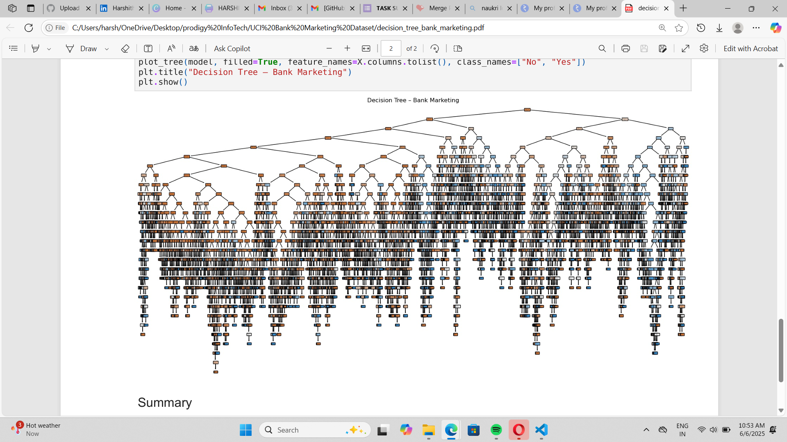

# 🌳 Decision Tree Classifier – Bank Marketing Dataset

This project builds a **Decision Tree Classifier** using the **Bank Marketing Dataset** from the UCI Machine Learning Repository. The goal is to predict whether a customer will subscribe to a term deposit based on demographic and behavioral data.

## 🔍 Project Highlights

- Data preprocessing and label encoding of categorical features
- Binary classification using **DecisionTreeClassifier** from `sklearn`
- Model evaluation with **accuracy score**, **confusion matrix**, and **classification report**
- Visual representation of the decision tree

## 🧰 Tools Used

- Python
- Pandas
- Scikit-learn
- Matplotlib
- Seaborn

## 📊 Visuals

### Decision Tree Plot

## 📁 Files Included

- `bank-full.csv` – Raw dataset
- `decision_tree_bank.ipynb` – Notebook with code and visuals
- `cleaned_data.csv` – Cleaned dataset (optional)
- `decision_tree_visualization.png` – Exported tree plot

## 📂 Dataset Source

**UCI Repository:**  
https://archive.ics.uci.edu/ml/datasets/Bank+Marketing

---

## 📌 Summary

This project was completed as **Task 03** during my **Data Science Internship at Prodigy InfoTech**.  
It allowed me to explore supervised machine learning, tree-based classifiers, and customer behavior prediction in a real-world scenario.

## 👩‍💻 Author
**Harshitha Adicherla** 

📬 Feedback and suggestions are welcome!
